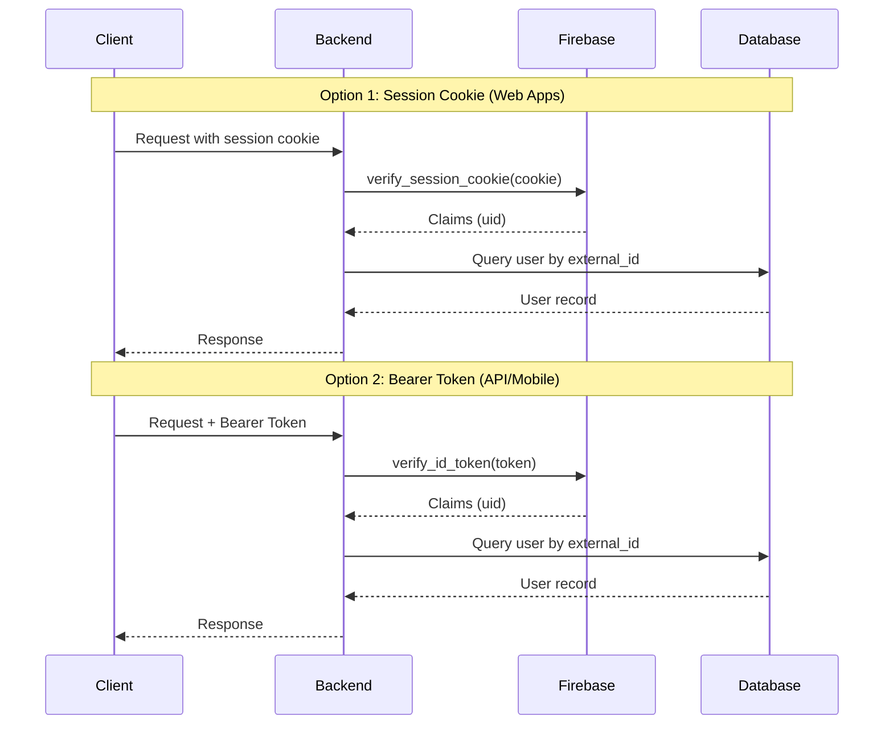
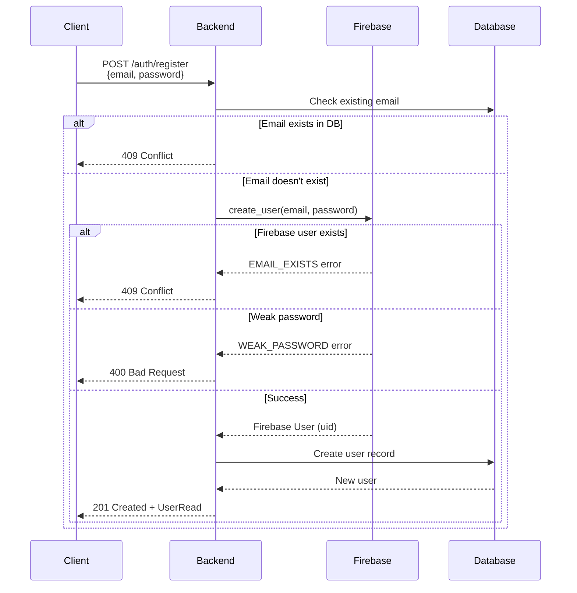
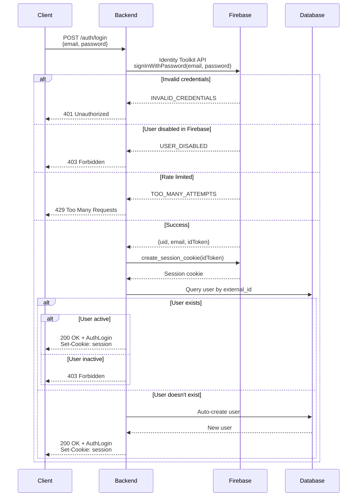
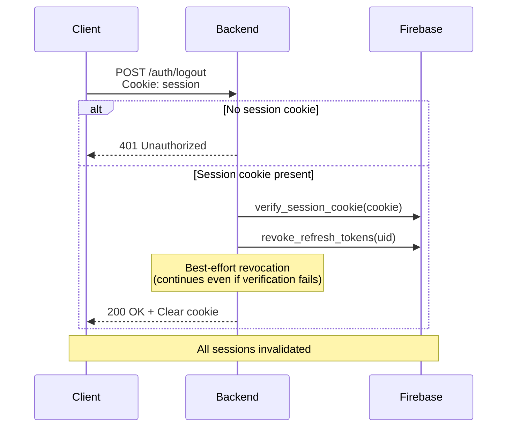
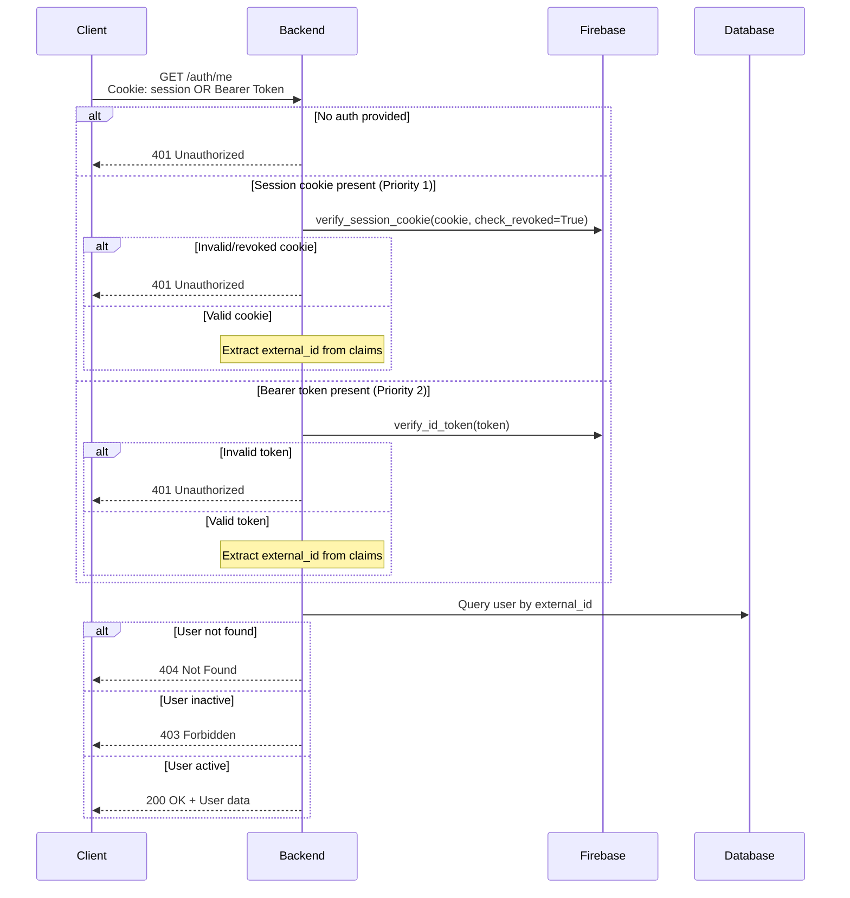
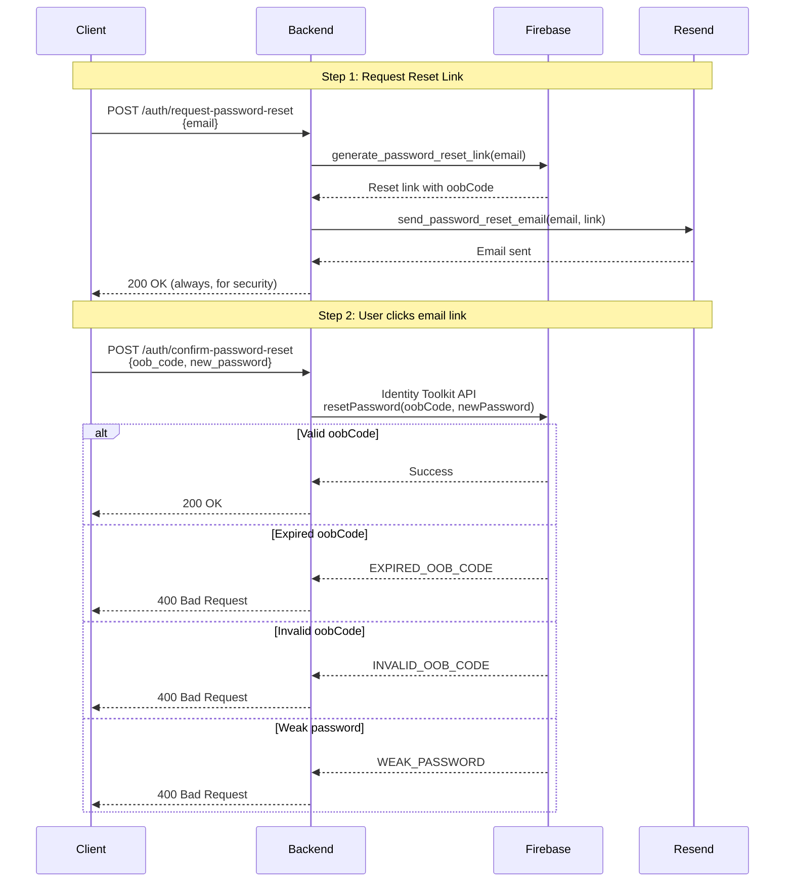
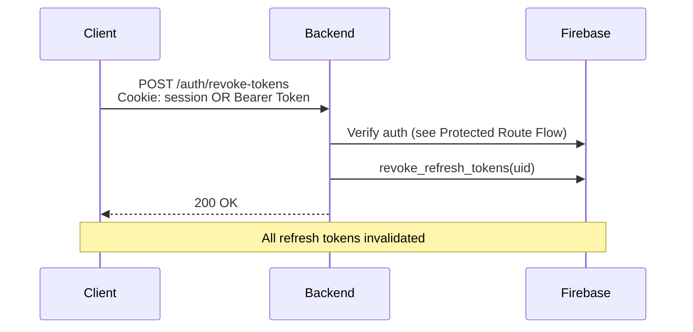

# Authentication & User Flow

## Overview

FastBack uses Firebase Authentication for identity management with a local database for user data storage. The backend supports two authentication methods:

1. **Session Cookie** (preferred for web apps) - Client logs in via `/auth/login` with email/password, backend sets an HttpOnly session cookie
2. **Bearer Token** (for API clients, mobile apps) - Client authenticates with Firebase directly, sends ID token in Authorization header

## Authentication Flow

Session cookie authentication takes priority when both methods are present.



## Registration Flow



## Login Flow



## Logout Flow



## Protected Route Flow



## Password Reset Flow



## Token Revocation Flow



## API Endpoints Summary

| Endpoint                       | Method | Auth   | Description                                      |
| ------------------------------ | ------ | ------ | ------------------------------------------------ |
| `/auth/register`               | POST   | None   | Create Firebase and local user (signup)          |
| `/auth/login`                  | POST   | None   | Login with email/password, sets session cookie   |
| `/auth/logout`                 | POST   | Cookie | Clear session cookie and revoke refresh tokens   |
| `/auth/request-password-reset` | POST   | None   | Send password reset email via Resend             |
| `/auth/confirm-password-reset` | POST   | None   | Complete reset with oobCode and new password     |
| `/auth/me`                     | GET    | User   | Get current user                                 |
| `/auth/revoke-tokens`          | POST   | User   | Revoke all refresh tokens (sign out all devices) |
| `/user/me`                     | PATCH  | User   | Update current user                              |
| `/user/me`                     | DELETE | User   | Delete current user                              |
| `/user/`                       | GET    | User   | List all users                                   |
| `/user/{id}`                   | GET    | User   | Get user by ID                                   |

## Response Schemas

### AuthLogin

Response schema returned by `/auth/login`:

```json
{
  "id": "uuid",
  "email": "user@example.com",
  "first_name": "John",
  "last_name": "Doe",
  "email_verified": false
}
```

**Fields:**

- `id` (UUID): User's unique identifier
- `email` (string): User's email address
- `first_name` (string): User's first name
- `last_name` (string): User's last name
- `email_verified` (boolean): Whether the user's email is verified (default: `false`)

## Auth Levels

- **None**: No authentication required
- **Cookie**: Requires valid session cookie (from `/auth/login`)
- **User**: Requires valid session cookie OR Bearer token + user must exist in database + user must be active

## Error Responses

| Status | Meaning                             |
| ------ | ----------------------------------- |
| 401    | Missing or invalid authentication   |
| 403    | User is inactive or disabled        |
| 404    | User not found in database          |
| 409    | Conflict (duplicate registration)   |
| 429    | Too many requests (rate limited)    |
| 502    | Authentication provider unavailable |
