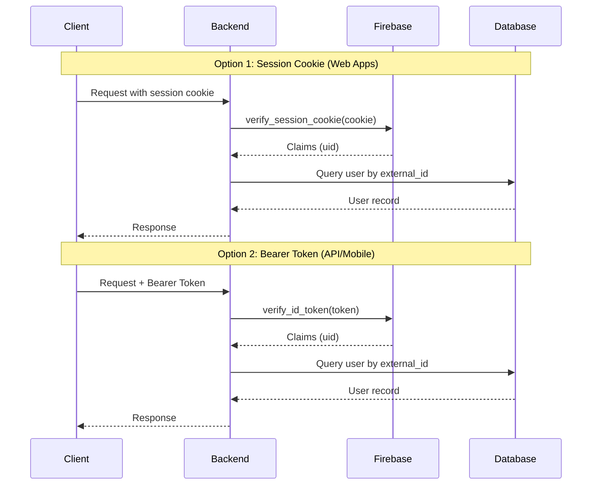
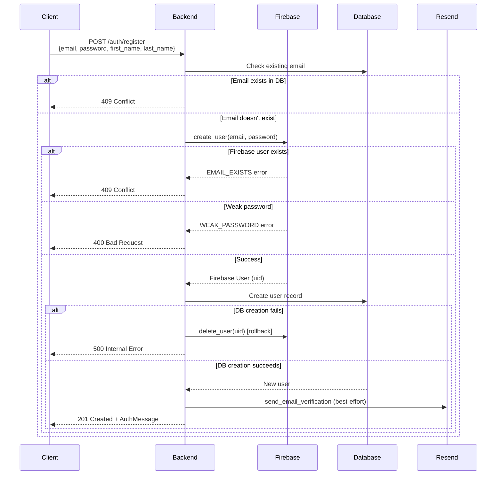
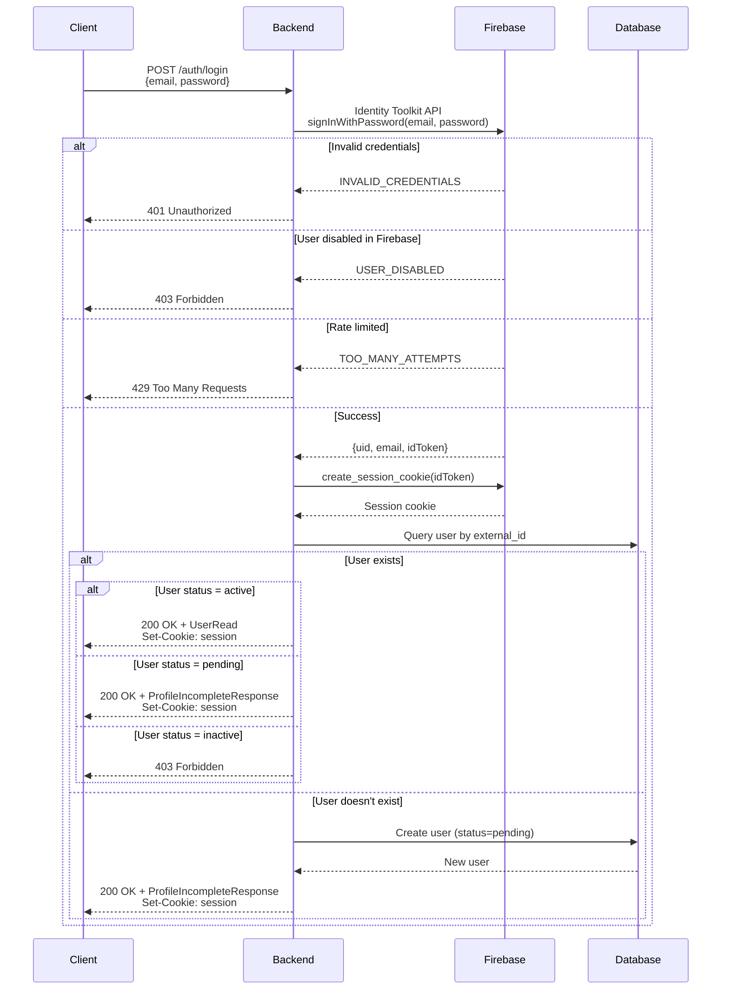
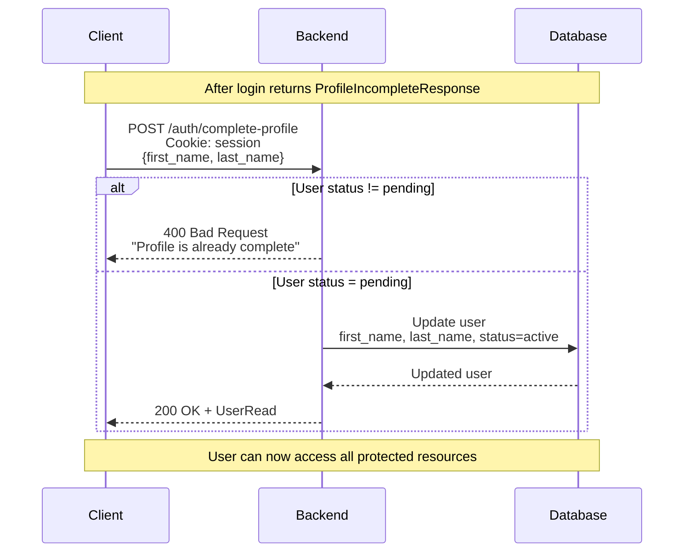
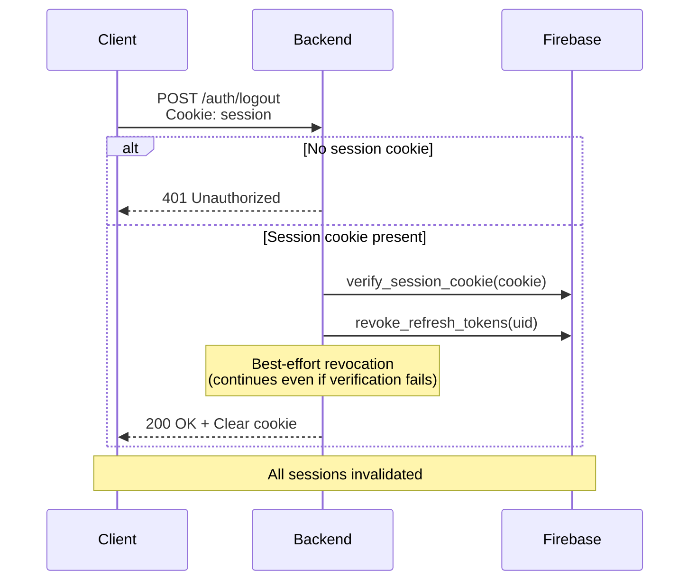
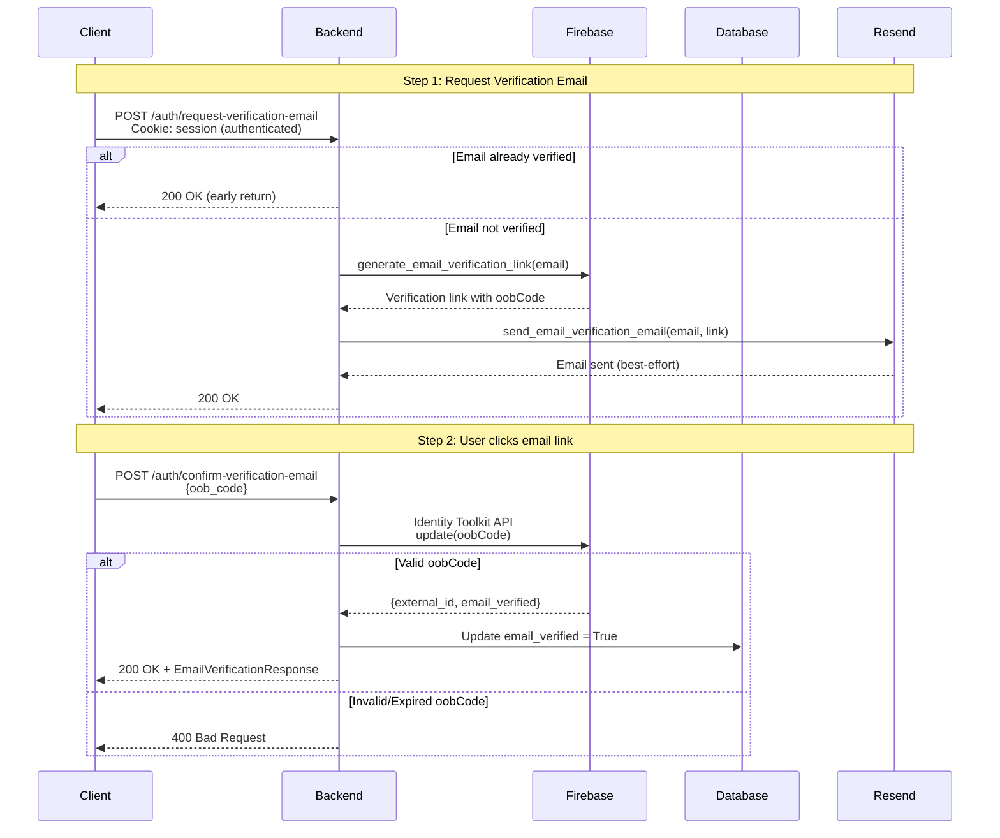
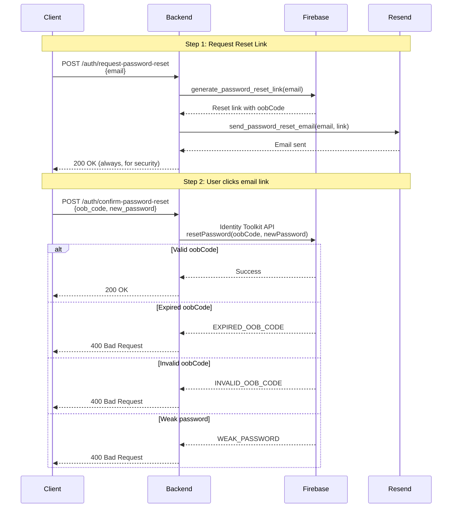
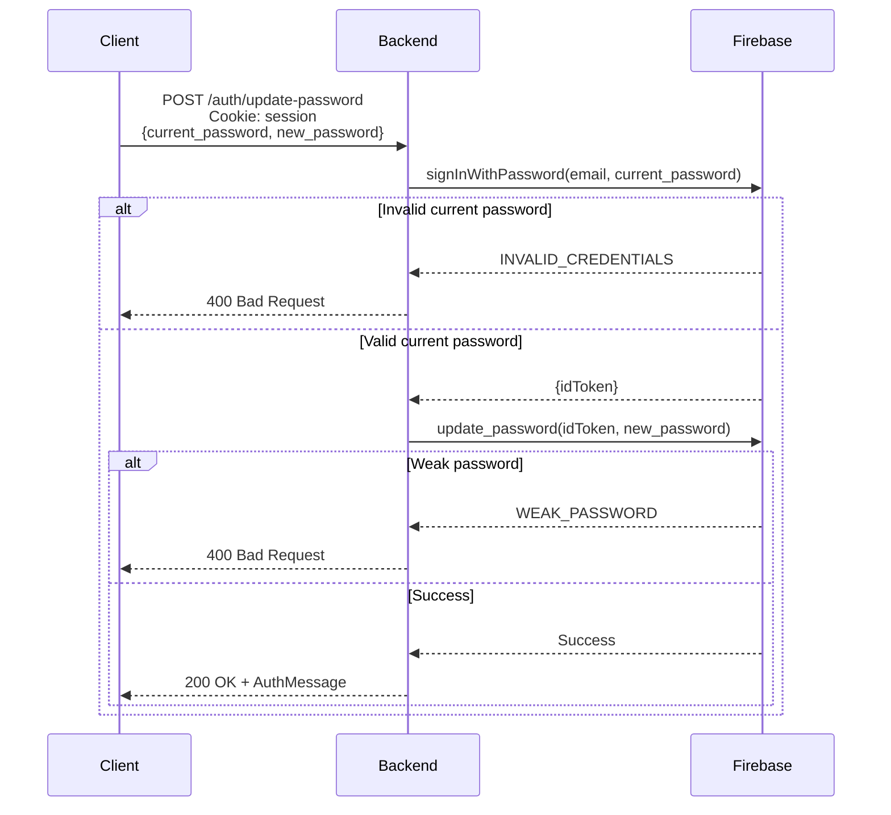
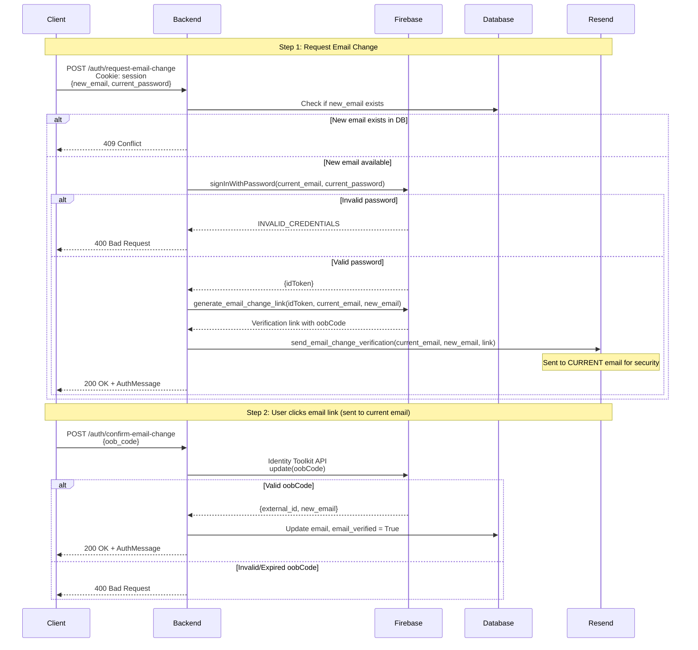
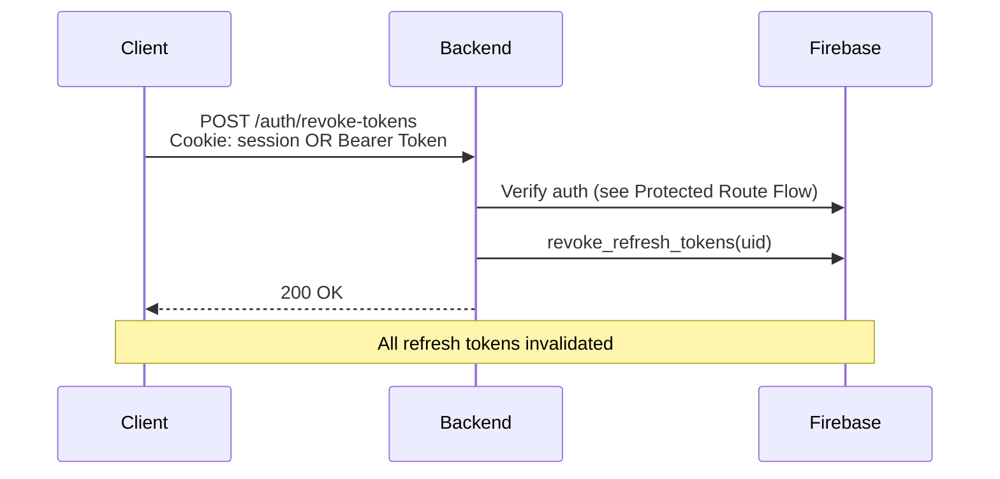

# Authentication & User Flow

## Overview

FastBack uses Firebase Authentication for identity management with a local database for user data storage. The backend supports two authentication methods:

1. **Session Cookie** (preferred for web apps) - Client logs in via `/auth/login` with email/password, backend sets an HttpOnly session cookie
2. **Bearer Token** (for API clients, mobile apps) - Client authenticates with Firebase directly, sends ID token in Authorization header

## User Status

Users have a `status` field with three possible values:

| Status     | Description                                      |
| ---------- | ------------------------------------------------ |
| `pending`  | Logged in via Firebase but profile not completed |
| `active`   | Profile complete, account active                 |
| `inactive` | Deactivated by admin                             |

**Status Transitions:**

- Registration with full details → `active`
- Firebase-first login (no local profile) → `pending`
- Profile completion → `pending` → `active`
- Admin deactivation → `inactive`

## Authentication Flow

Session cookie authentication takes priority when both methods are present.



## Registration Flow



## Login Flow



## Profile Completion Flow

When a user logs in but has `status=pending`, they must complete their profile before accessing protected resources.



**Profile Completion Required When:**

- User exists in Firebase but not in local DB (first login via Firebase SDK)
- User exists locally but `status=pending`

**Frontend Handling:**

1. Check login response for `status: "profile_incomplete"`
2. Redirect to profile completion form
3. Submit `POST /auth/complete-profile` with name fields
4. On success, user is fully authenticated with `status=active`

## Logout Flow



## Protected Route Flow


## Email Verification Flow



## Password Reset Flow



## Update Password Flow (Authenticated)



## Email Change Flow



## Token Revocation Flow



## API Endpoints Summary

### Authentication Endpoints

| Endpoint                           | Method | Auth   | Description                                         |
| ---------------------------------- | ------ | ------ | --------------------------------------------------- |
| `/auth/register`                   | POST   | None   | Create Firebase and local user (status=active)      |
| `/auth/login`                      | POST   | None   | Login with email/password, sets session cookie      |
| `/auth/logout`                     | POST   | Cookie | Clear session cookie and revoke refresh tokens      |
| `/auth/complete-profile`           | POST   | User   | Complete pending profile (status: pending → active) |
| `/auth/me`                         | GET    | User   | Get current user                                    |
| `/auth/request-password-reset`     | POST   | None   | Send password reset email via Resend                |
| `/auth/confirm-password-reset`     | POST   | None   | Complete reset with oobCode and new password        |
| `/auth/request-verification-email` | POST   | User   | Send email verification link                        |
| `/auth/confirm-verification-email` | POST   | None   | Verify email with oobCode                           |
| `/auth/update-password`            | POST   | User   | Update password (requires current password)         |
| `/auth/request-email-change`       | POST   | User   | Request email change (sends to current email)       |
| `/auth/confirm-email-change`       | POST   | None   | Confirm email change with oobCode                   |
| `/auth/revoke-tokens`              | POST   | User   | Revoke all refresh tokens (sign out all devices)    |

### User Management Endpoints

| Endpoint           | Method | Auth  | Description         |
| ------------------ | ------ | ----- | ------------------- |
| `/users/me`        | PATCH  | User  | Update current user |
| `/users/me`        | DELETE | User  | Delete current user |
| `/users/`          | GET    | Admin | List all users      |
| `/users/{user_id}` | GET    | Admin | Get user by ID      |
| `/users/{user_id}` | PATCH  | Admin | Update user by ID   |

## Request Schemas

### AuthRegister

Request schema for `/auth/register`:

```json
{
  "email": "user@example.com",
  "password": "securePassword123",
  "first_name": "John",
  "last_name": "Doe"
}
```

**Fields:**

- `email` (EmailStr): Valid email address (required)
- `password` (string): Password with minimum 8 characters (required)
- `first_name` (string): User's first name, minimum 1 character (required)
- `last_name` (string): User's last name, minimum 1 character (required)

### EmailPasswordLoginRequest

Request schema for `/auth/login`:

```json
{
  "email": "user@example.com",
  "password": "securePassword123"
}
```

**Fields:**

- `email` (EmailStr): Valid email address (required)
- `password` (string): User's password (required)

### CompleteProfileRequest

Request schema for `/auth/complete-profile` (defined in `app/user/schemas.py`):

```json
{
  "first_name": "John",
  "last_name": "Doe"
}
```

**Fields:**

- `first_name` (string): User's first name (1-50 characters, required)
- `last_name` (string): User's last name (1-50 characters, required)

### PasswordResetRequest

Request schema for `/auth/request-password-reset`:

```json
{
  "email": "user@example.com"
}
```

**Fields:**

- `email` (EmailStr): Valid email address (required)

### ConfirmPasswordResetRequest

Request schema for `/auth/confirm-password-reset`:

```json
{
  "oob_code": "abc123...",
  "new_password": "newSecurePassword123"
}
```

**Fields:**

- `oob_code` (string): Out-of-band code from password reset email (required)
- `new_password` (string): New password to set (required)

### ConfirmEmailVerificationRequest

Request schema for `/auth/confirm-verification-email`:

```json
{
  "oob_code": "abc123..."
}
```

**Fields:**

- `oob_code` (string): Out-of-band code from verification email (required)

### UpdatePasswordRequest

Request schema for `/auth/update-password`:

```json
{
  "current_password": "oldPassword123",
  "new_password": "newSecurePassword123"
}
```

**Fields:**

- `current_password` (string): Current password for verification (required)
- `new_password` (string): New password to set (required)

### RequestEmailChangeRequest

Request schema for `/auth/request-email-change`:

```json
{
  "new_email": "newemail@example.com",
  "current_password": "currentPassword123"
}
```

**Fields:**

- `new_email` (EmailStr): New email address (required)
- `current_password` (string): Current password for re-authentication (required)

### ConfirmEmailChangeRequest

Request schema for `/auth/confirm-email-change`:

```json
{
  "oob_code": "abc123..."
}
```

**Fields:**

- `oob_code` (string): Out-of-band code from email change verification email (required)

## Response Schemas

### UserRead

Response schema returned by `/auth/login` (for active users), `/auth/me`, and `/auth/complete-profile`:

```json
{
  "id": "uuid",
  "email": "user@example.com",
  "first_name": "John",
  "last_name": "Doe",
  "email_verified": false,
  "status": "active",
  "is_admin": false,
  "created_at": "2026-01-19T12:34:56Z",
  "updated_at": "2026-01-19T12:34:56Z"
}
```

**Fields:**

- `id` (UUID): User's unique identifier
- `email` (string): User's email address
- `first_name` (string | null): User's first name
- `last_name` (string | null): User's last name
- `email_verified` (boolean): Whether the user's email is verified (default: `false`)
- `status` (string): User account status (`pending`, `active`, `inactive`)
- `is_admin` (boolean): Whether the user has admin privileges (default: `false`)
- `created_at` (string): ISO 8601 datetime when user was created
- `updated_at` (string): ISO 8601 datetime when user was last updated

### ProfileIncompleteResponse

Response returned by `/auth/login` when user profile needs completion (status=pending):

```json
{
  "status": "profile_incomplete",
  "message": "Please complete your profile",
  "email": "user@example.com"
}
```

**Fields:**

- `status` (string): Always `"profile_incomplete"`
- `message` (string): Human-readable message for the client
- `email` (string): User's email address (for display in profile completion form)

### AuthMessage

Response schema for registration and various confirmation endpoints:

```json
{
  "message": "User registered successfully"
}
```

### AuthLogout

Response schema for `/auth/logout`:

```json
{
  "message": "Logout successful"
}
```

### EmailVerificationResponse

Response schema for `/auth/confirm-verification-email`:

```json
{
  "email_verified": true,
  "message": "Email verified successfully"
}
```

### PasswordResetResponse

Response schema for `/auth/request-password-reset`:

```json
{
  "message": "If an account with that email exists, a password reset link has been sent"
}
```

## Auth Levels

- **None**: No authentication required
- **Cookie**: Requires valid session cookie (from `/auth/login`)
- **User**: Requires valid session cookie OR Bearer token + user must exist in database + user must not be inactive
- **Admin**: Requires User auth level + user must have `is_admin = true`

**Status Behavior:**

| Status     | Can Authenticate?  | Can Access Protected Routes?      |
| ---------- | ------------------ | --------------------------------- |
| `pending`  | Yes                | Yes (but should complete profile) |
| `active`   | Yes                | Yes                               |
| `inactive` | No (403 Forbidden) | No                                |

Note: Users with `status=pending` can access protected routes but should be prompted to complete their profile via the frontend.

## Session Cookie Properties

| Property | Value                                               |
| -------- | --------------------------------------------------- |
| Name     | `session`                                           |
| Max-Age  | 5-14 days (configurable via `SESSION_EXPIRES_DAYS`) |
| HttpOnly | `true` (prevents JavaScript access)                 |
| Secure   | `true` in production, `false` in dev                |
| SameSite | `lax` (CSRF protection)                             |

## Error Responses

All error responses follow a consistent format:

```json
{
  "error_type": "error_type_identifier",
  "message": "Human-readable error message"
}
```

### Error Types by Status Code

| Status | error_type                 | Description                                          |
| ------ | -------------------------- | ---------------------------------------------------- |
| 400    | `bad_request`              | General bad request                                  |
| 400    | `validation_error`         | Request validation failed                            |
| 400    | `weak_password`            | Password is too weak                                 |
| 400    | `password_policy_error`    | Password doesn't meet policy requirements (detailed) |
| 400    | `email_verification_error` | Email verification failed (invalid/expired oobCode)  |
| 400    | `email_change_error`       | Email change failed (invalid/expired oobCode)        |
| 401    | `invalid_credentials`      | Invalid email or password                            |
| 401    | `invalid_token`            | Invalid or expired authentication token              |
| 401    | `session_cookie_error`     | Session cookie is invalid                            |
| 401    | `session_expired`          | Session has expired                                  |
| 403    | `user_disabled`            | User account is disabled in Firebase                 |
| 403    | `user_inactive`            | User status is inactive in local database            |
| 403    | `admin_required`           | Admin privileges required                            |
| 404    | `user_not_found`           | User not found in database                           |
| 409    | `email_exists`             | Email already registered                             |
| 429    | `rate_limit_exceeded`      | Too many requests (includes `retry_after` field)     |
| 500    | `internal_error`           | Internal server error                                |
| 502    | `provider_error`           | Authentication provider unavailable or error         |

### Password Policy Error

When Firebase password policies are enabled, a detailed error is returned:

```json
{
  "error_type": "password_policy_error",
  "message": "Password does not meet requirements: containsLowercaseCharacter, containsNumericCharacter"
}
```

The `requirements` list may include:

- `containsLowercaseCharacter`
- `containsUppercaseCharacter`
- `containsNumericCharacter`
- `containsNonAlphanumericCharacter`
- `minPasswordLength`
- `maxPasswordLength`

### Rate Limit Error

Rate limit responses include an optional `retry_after` field (in seconds):

```json
{
  "error_type": "rate_limit_exceeded",
  "message": "Too many attempts, try again later",
  "retry_after": 60
}
```

### Session Expiration Errors

The following Firebase errors are mapped to user-friendly messages:

| Firebase Error                   | User Message                                    |
| -------------------------------- | ----------------------------------------------- |
| `CREDENTIAL_TOO_OLD_LOGIN_AGAIN` | Session expired, please login again to continue |
| `TOKEN_EXPIRED`                  | Session expired, please login again             |
| `INVALID_ID_TOKEN`               | Session expired, please login again             |

## Security Considerations

1. **Email Enumeration Prevention**: Password reset always returns success regardless of whether email exists
2. **Email Change Security**: Verification email sent to current email, not new email
3. **Re-authentication**: Password update requires current password verification
4. **Session Revocation**: Logout revokes all refresh tokens, signing out all devices
5. **Rollback on Failure**: Firebase user is deleted if local database creation fails during registration
6. **Best-effort Emails**: Email sending failures don't fail critical operations (registration, login)

## Developer Reference

### Dependency Injection Types

The auth module provides typed dependencies for FastAPI route handlers (defined in `app/auth/dependencies.py`):

```python
from app.auth.dependencies import (
    CurrentUserDep,      # Annotated[User, Depends(get_current_user)]
    FirebaseAuthDep,     # Annotated[FirebaseAuthService, Depends(get_firebase_auth_service)]
    AdminUserDep,        # Annotated[User, Depends(get_admin_user)]
    require_auth,        # Router-level auth dependency
    require_admin,       # Router-level admin dependency
)
```

**Usage Examples:**

```python
# Endpoint that needs current user
@router.get("/profile")
async def get_profile(user: CurrentUserDep):
    return user

# Admin-only endpoint
@router.get("/admin/users")
async def list_users(admin: AdminUserDep):
    ...

# Router-level authentication (all routes require auth)
router = APIRouter(dependencies=[Depends(require_auth)])

# Router-level admin requirement
admin_router = APIRouter(dependencies=[Depends(require_admin)])
```

### Authentication Priority

When both session cookie and Bearer token are present, the dependency checks in this order:

1. **Session cookie** (priority 1) - Preferred for web apps
2. **Bearer token** (priority 2) - For API clients and mobile apps

### Firebase Auth Service

The `FirebaseAuthService` class (`app/auth/service.py`) provides all Firebase operations:

| Method                               | Description                                |
| ------------------------------------ | ------------------------------------------ |
| `sign_in_with_email_password()`      | Authenticate via Identity Toolkit REST API |
| `create_session_cookie()`            | Create session cookie from ID token        |
| `verify_session_cookie()`            | Verify session cookie, returns claims      |
| `verify_id_token()`                  | Verify ID token, returns claims            |
| `create_user()`                      | Create new Firebase user                   |
| `delete_user()`                      | Delete Firebase user (best-effort)         |
| `revoke_refresh_tokens()`            | Revoke all refresh tokens for user         |
| `generate_password_reset_link()`     | Generate password reset link               |
| `generate_email_verification_link()` | Generate email verification link           |
| `generate_email_change_link()`       | Generate email change verification link    |
| `confirm_password_reset()`           | Confirm password reset with oobCode        |
| `confirm_email_verification()`       | Confirm email verification with oobCode    |
| `confirm_email_change()`             | Confirm email change with oobCode          |
| `update_password()`                  | Update user password with ID token         |
| `get_user()`                         | Get Firebase user record by UID            |

### Identity Toolkit Endpoints

The service uses Firebase Identity Toolkit REST API for client-side operations:

| Operation             | Endpoint                         |
| --------------------- | -------------------------------- |
| Sign in with password | `v1/accounts:signInWithPassword` |
| Send OOB code         | `v1/accounts:sendOobCode`        |
| Update account        | `v1/accounts:update`             |
| Reset password        | `v1/accounts:resetPassword`      |
